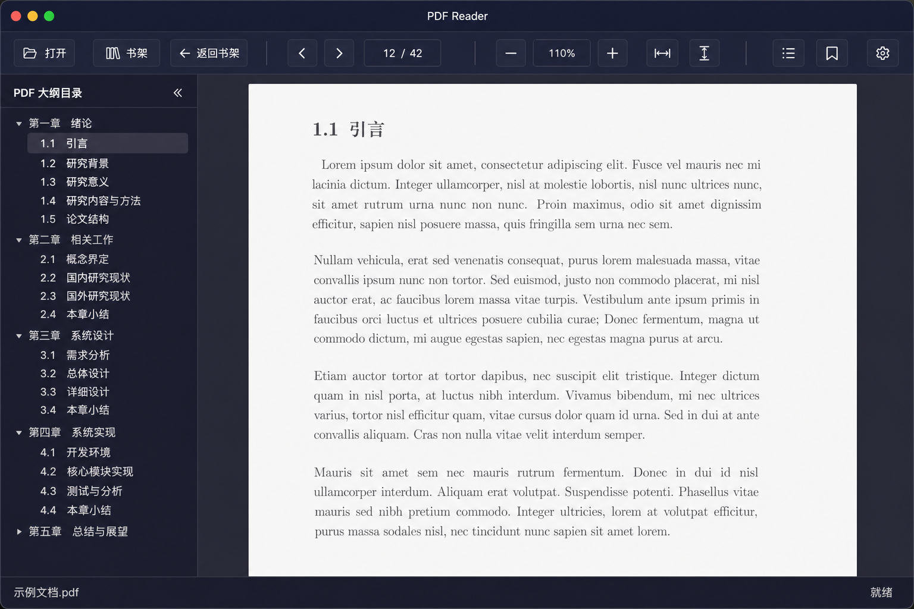

# PDF Reader for macOS Intel

轻量级电子书阅读器（**PDF + EPUB**），基于 Electron、PDF.js 与 Epub.js：单页/分页阅读、书架、阅读书签与进度、多套界面主题（含浅色）、应用内设置；书架支持 PDF / EPUB 封面预览；开发与打包使用 **`icons/icon.png`** 作为窗口与 Dock 图标。

产品名称与打包产物一致：**PDF Reader**（`electron-builder.json` 中 `productName`）。

## 应用截图

以下为阅读态界面示意（午夜蓝主题，左侧为 PDF 大纲目录侧栏；实际排版随文档与窗口尺寸变化）。



## 功能特性

### 文件与书架

- 「**打开…**」：选择单个 **`pdf` / `epub`**（系统对话框过滤）。
- 「**书架…**」：选择文件夹作为书架；自动列出其中 **PDF / EPUB**。点击「书架」旁的交互可展开 **历史书架路径** 列表（近期用过的文件夹路径会置顶保存，最多约 **30** 条），便于在不重复浏览对话框的情况下切换书架。
- 当前书架路径持久保存在用户数据文件中，下次启动可自动恢复并展示书架。
- 拖拽 **PDF / EPUB** 到窗口或欢迎区域的放置区即可打开。
- 书架网格支持封面缩略图（PDF 首页、EPUB 封面）；同一会话内已生成的封面画布会按需跳过重复解码。

### 阅读视图（PDF）

- 单画布单页分页阅读；上一页 / 下一页按钮、当前页数值输入、`←` / `→` 快捷键。
- **适应宽度**：整页横向适配窗口可视宽度；超长页可在 **`pdf-container` 内纵向滚动**查看。
- **适应高度**、放大镜级 **放大 / 缩小**，以及工具栏百分比显示；**缩放比例可直接在百分比框内编辑**（输入数字或带 `%`，按 Enter 或失焦生效）。
- **高 DPI**：画布按设备像素比放大渲染，兼顾逻辑尺寸与清晰度。
- **PDF 大纲目录**（侧栏，与下文「阅读书签」区分）。
- **阅读书签**：当前位置添加与列表跳转；可与 EPUB **CFI 书签**共存于同一存储结构（路径维度）。

### 阅读视图（EPUB）

- 使用 **esbuild 打包的 `public/vendor/epub-browser.mjs`**，在**渲染进程**通过动态 `import` 载入 Epub.js（不经 `contextBridge` 传递 Book 实例，以避免克隆破坏内部 Promise）。
- 若直接 `file://` 载入依赖失败，会经 **主进程 `readFile` + IPC** 再走 **Blob URL** 回退。
- 缩放以 **百分比**展示（可与 PDF 共用工具栏缩放区），范围约 **60%–220%**；同样支持 **直接编辑百分比**。
- 目录、「我的书签」侧栏在阅读态可用。

### 性能与超大 PDF

- 主进程 **`fs.promises.readFile`** 异步读盘。
- **`getDocument` onProgress**：在能提供 `loaded/total` 时更新「解析」进度文案。
- **延后大纲**：先渲染首页并隐藏加载层，再后台解析 **`getOutline`**，降低超长文档首屏卡顿感。
- 阅读进度与书签请求可 **`Promise.all`** 并行。
- PDF 引擎按需 **`import`**，不阻塞首屏脚本。

### 界面、主题与菜单

- **主题**：午夜蓝、石墨灰、深海青、琥珀棕、日间纸本等；**设置**（工具栏齿轮）中可切换，并写入用户数据；窗口背景色随主题调整。
- **书架 / 欢迎页**：仅显示「**打开**」「**书架**」等必要项；**`#toolbarReading`** 在阅读态才展开。
- **应用菜单**（节选）：文件「打开…」、书架文件夹、返回书架；视图含缩放、**主题**单选子菜单、**PDF 目录侧栏**（⌘⇧T）、界面重载；书签菜单与阅读书签侧栏（⌘⇧B）。

### 其它

- **添加阅读书签**：Electron 环境下原生 `prompt` 不可靠时，使用应用内「书签名称」对话框录入标签。
- **状态栏**：阅读时可显示当前文件名片段与简短状态文案（如「就绪」）。
- 阅读位置防抖保存（约 1 秒）；`electron-builder` 可打 **`.app` / zip / dmg**（x64）。

## 开发环境

- **Node.js**：v18.x 或更高  
- **npm**：v9.x 或更高  
- **Electron**：v28.x  
- **PDF.js**：v4.x（`pdfjs-dist/legacy`，渲染进程动态导入）  
- **Epub.js**：随 `npm` 安装；**浏览器包**由 **`npm run bundle:epub`**（esbuild）生成 **`public/vendor/epub-browser.mjs`**  
- **electron-builder**：v24.x  
- **esbuild**：开发依赖，用于上述 EPUB 打包脚本  

## 安装依赖

```bash
npm install
```

首次克隆或升级 **epubjs** 后，建议执行一次：

```bash
npm run bundle:epub
```

以生成或更新 **`public/vendor/epub-browser.mjs`**（阅读器运行时依赖）。

## 开发运行

```bash
npm run dev
```

或：

```bash
npm start
```

须在图形会话中启动 Electron。**`icons/icon.png`** 存在时用作窗口图标与 Dock 图标参考。

## 构建打包

配置见 **`electron-builder.json`**（**`icon`: `icons/icon.png`**）与 **`package.json`** 的 `scripts`。

### `npm run build`（zip + dmg）

```bash
npm run build
```

产出在 **`dist/`**（名称随版本），通常为：

- **`PDFReader-<version>-mac-x64.zip`**：解压后得到 **`PDF Reader.app`**（Dock 名称仍为「PDF Reader」），可拖到「应用程序」使用。  
- **`PDFReader-<version>-mac-x64.dmg`**：挂载后将 **`PDF Reader.app`** 拖到「应用程序」文件夹即可安装。

说明：**GitHub Releases** 会为每个 Release **自动生成「Source code (zip/tar.gz)」**，这是平台默认行为；下面的 **zip / dmg** 是额外上传的 **可安装的 macOS 应用包**（内含 **`PDF Reader.app`**），下载时请认准 **`PDFReader-*-mac-x64.*`** 文件名。

### 可直接运行的 .app 目录

```bash
npm run build:dir
```

通常在 **`dist/mac/PDF Reader.app`**。

### GitHub Actions 自动 Release

仓库已包含 **`.github/workflows/release.yml`**：

| 触发方式 | 行为 |
|---------|------|
| 推送符合 **`v*`** 的标签（例如 **`v1.0.0`**） | 在 `macos-latest` 上执行 **`npm ci`** → **`bundle:epub`** → **`npm run build`**，校验标签名与 **`package.json`** 的 **`version`** 一致（须为 **`v` + version**），然后将 **`dist/*.zip`** 与 **`dist/*.dmg`** 上传到同名 **GitHub Release**，并自动生成 Release Notes。 |
| **Actions** 里手动运行 workflow | 仅构建并上传 **Artifacts**（`pdf-reader-mac-x64`，内含 zip + dmg），**不会**创建 Release，便于先试 CI。 |

发布新版本示例：

```bash
# 先修改 package.json 的 version，提交并推送代码
npm version patch   # 或手动编辑 version 后 git commit

git tag v$(node -p "require('./package.json').version")
git push origin main --tags
# 若只推送标签：git push origin v1.0.1
```

仓库使用默认 **`GITHUB_TOKEN`** 即可创建 Release。若 Workflow 无权写入，请到 GitHub：**Settings → Actions → General → Workflow permissions**，勾选 **Read and write permissions**。

## 目录结构（概要）

```
pdf-reader-mac/
├── docs/
│   └── screenshot.png   # README 用界面示意图（可按需替换为真实截图）
├── src/
│   ├── main.js          # Electron 主进程（窗口、IPC、菜单、托盘/Dock）
│   └── preload.js       # contextBridge：仅 IPC，不含 Epub 运行时对象
├── public/
│   ├── index.html
│   ├── styles.css
│   ├── renderer.js      # 渲染进程 UI / PDF / EPUB（ES Module）
│   └── vendor/
│       └── epub-browser.mjs   # esbuild 打好的 Epub.js（勿手改；见 bundle:epub）
├── icons/
│   └── icon.png         # 应用图标（Dock / 打包；直接可 git add）
├── dist/                # 构建产出（不入库）
├── electron-builder.json
├── package.json
├── SPEC.md
└── README.md
```

## 键盘与应用菜单快捷键（节选）

| 快捷键 | 功能 |
|--------|------|
| ← / → | 上一页 / 下一页（焦点不在输入框时） |
| Cmd/Ctrl + O | 打开文件（PDF / EPUB） |
| Cmd/Ctrl + Shift + O | 选择书架文件夹 |
| Cmd/Ctrl + B | 返回书架 |
| Cmd/Ctrl + D | 添加阅读书签 |
| Cmd/Ctrl + Shift + T | 显示 / 切换 PDF 大纲目录侧栏 |
| Cmd/Ctrl + Shift + B | 显示 / 切换「我的书签」侧栏 |
| Cmd/Ctrl + = / Cmd/Ctrl + - | 放大 / 缩小 |
| Cmd/Ctrl + 0 | 适应页面宽度 |
| Cmd/Ctrl + 1 | 适应窗口高度 |
| Cmd/Ctrl + R | 重新加载渲染进程界面 |

（与 **`src/main.js`** 中 **`createMenu`** 完全一致；若有差异以实现为准。）

## 使用说明

### 书架

1. 点击「书架」，选择包含 **PDF / EPUB** 的文件夹。  
2. 路径会保存；下次启动可恢复书架网格。  
3. 单击某个图书条目打开阅读。  
4. 「更换文件夹」可切换书架目录。  
5. 阅读页可通过「返回书架」回到网格；同会话内尽量不重复解码已有封面。

### 打开单个文件

点击「打开…」或通过菜单选择 **PDF / EPUB**；也可将文件拖到欢迎区。

### 阅读位置与书签

进度与书签按文件路径保存在用户数据中；PDF 保存页码，EPUB 可保存 **CFI** 等与 Epub.js 一致的定位信息（实现以代码为准）。

### 视图与缩放

- 「适应宽度」下若一页高于可视区，在中间阅读区 **上下滚动** 查看全文。  
- **工具栏缩放百分比**可点击后直接修改数字（**25%–500%**，PDF **自定义缩放**；EPUB **60%–220%**），**Enter** 或 **失焦** 后生效。

## 数据存储

用户数据保存在（实际目录以 Electron **`userData`** 为准）：

`~/Library/Application Support/pdf-reader-mac/pdf-reader-data.json`

内容通常包括：**阅读位置**、各文件书签、**当前书架路径**（`shelfFolder`）、**书架路径历史**（`shelfFolderHistory`，字符串数组）、`theme`（当前主题 ID）等。

## 构建、图标与版本库

- **`electron-builder.json`**：配置 `appId`、`productName`、`icon`（指向 **`icons/icon.png`**）。  
- 推荐放置 **不小于 512×512** 的 **`icons/icon.png`**。开发时 **`main.js`** 在文件存在时使用 **Dock** 与 **BrowserWindow** 图标。  
- 应用图标放在 **`icons/icon.png`**。目录名 **`icons/`** 不会被通用 **`**/build/`** 规则忽略，**可直接 `git add icons/icon.png`**；不必再依赖 **`!`** 解除忽略。

## 常见问题

- **EPUB 报「加载引擎」**：确认已 **`npm run bundle:epub`**，且 **`public/vendor/epub-browser.mjs`** 存在；若仍失败，可看终端 **`[read-epub-vendor-bundle]`** 与开发者工具控制台。  
- **构建报错**：以 **`electron-builder.json`**、**`package.json`** 脚本为准；默认 **`npm run build`** 产出 zip + dmg，`build:dir` 产出可直接运行的 `.app` 目录。  
- **本机构建 dmg 失败（如 `hdiutil … Device not configured`）**：常见于沙箱、远程或无可用磁盘映像驱动的环境；产物优先以 **GitHub Actions** 为准。zip 一般不依赖 `hdiutil`，可先使用 **`PDFReader-*-mac-x64.zip`**。  
- **超大 PDF**：已用进度、延后大纲、异步读盘等缓解；全量解析仍受 PDF.js 与本机性能限制。  
- 克隆后请先 **`npm install`**，必要时 **`npm run bundle:epub`**。

## License

MIT
